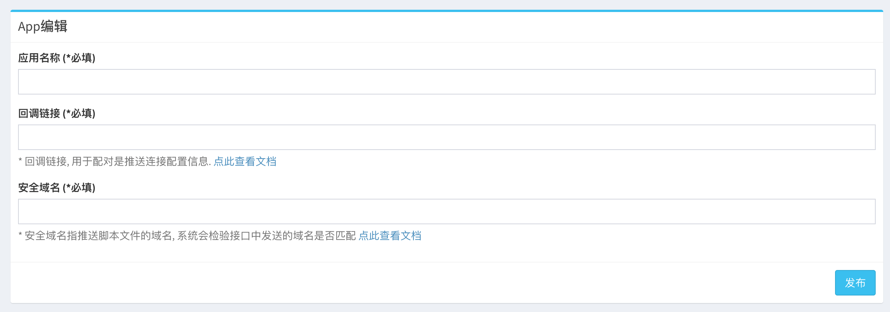
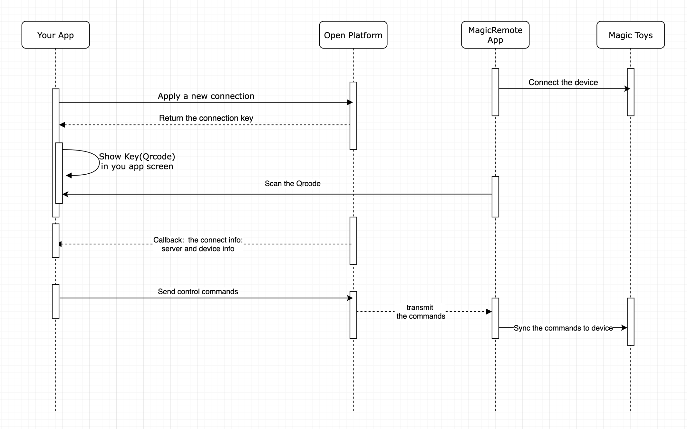

# MagicRemote 使用文档

## 场景介绍

* MagicRemote是一个开放平台, 开发者可以通过开放平台注册, 接入自己的应用,网站,平台, 然后通过MagicRemote平台远程控制魅动智能产品.

## 接入流程

1. 注册
    * 前往 [https://mg-dash.vtio.cn/](https://mg-dash.vtio.cn/) 进行注册
    * 验证邮箱
2. 创建应用, 设置回调链接和安全域名
   
    * 填写您的应用名
    * 填写您的服务器上接受回调的链接, 回调链接说明请参考 `[下一章]` `如何开发您的应用` `步骤3`
        * 在每一次MagicRemote App和您的应用进行配对时, 此链接将会接受开放平台的回调
    * 填写您存放funscript脚本的域名地址, 后续推送script脚本, 会检验域名是否符合安全域名, 此处无需http, 只需要裸域名
3. 接入您的应用
    * 创建应用完成后, 您将在页面上获得您的AppID和AppSecret

## 如何开发您的应用

* 流程图

1. 申请一个新的链接
    * 链接地址 `https://mg-api.vtio.cn/open/connect/apply` `POST`
    * headers中 包含 `{'token': [应用的AppSecret]}`
    * 返回 申请链接的key:
        * success: true/false
        * result:
            * {"key": [key]}

2. 将key转换成二维码展现在您的app界面
    * 网页
        * 原生JS [qrcode.js](http://davidshimjs.github.io/qrcodejs/)
        * NodeJs [node-qrcode](https://www.npmjs.com/package/qrcode)
    * Android
    * iOS
3. 使用MagicRemoteApp 扫码展现在您应用上的二维码
4. 开放平台将会调用您配置的回调链接, 将链接信息
    * 请在您的服务器上以`POST`方式接受表单, 表单key为`data`
    * data包含:
        * `key` 链接的key
        * `code` 推送命令时鉴权的代码
        * `server` 服务器配置信息, 包含访问链接地址等...
        * `device` 控制的设备的信息
5. 发送命令
    * 向 `server` 信息包含的url 发送 `post`请求
    * 表单内容:
        * `key` 链接的key
        * `code` 鉴权的代码
        * `data` 命令内容, dump过后的json字符串, 参看 `推送命令`

6. 获取设备链接信息
    * 链接地址 `https://mg-api.vtio.cn/open/device/status?key=[key]`
    * headers中 包含 `{'token': [应用的AppSecret]}`
    * 建议3-5秒查询一次
    * 返回 设备设备状态和设备信息:
        * success: true/false
        * result:
            * device_status
                * 1 online
                * 2 offline
            * device
                * 设备信息的json字符串

## 推送命令

### 普通操控

* 震动
    * cmd: s1
    * pos: 震动强度 0-100

### 播放funscript

* 推送脚本
    * cmd: script
    * link: 下载链接

* 播放
    * cmd: play
    * ts: 播放序列时间轴上时间戳
    * op_ts: 命令操作的时间戳

* 暂停
    * cmd: pause
    * op_ts: 命令操作的时间戳

* 寻址
    * cmd: seek
    * ts: 播放序列时间轴上时间戳
    * op_ts: 命令操作的时间戳

* 对帧
    * cmd: frame
    * ts: 播放序列时间轴上时间戳
    * op_ts: 命令操作的时间戳

## Demo

* [Demo](https://htmlpreview.github.io/?https://github.com/vtrump/magicremote-docs/blob/main/docs/demo.html)