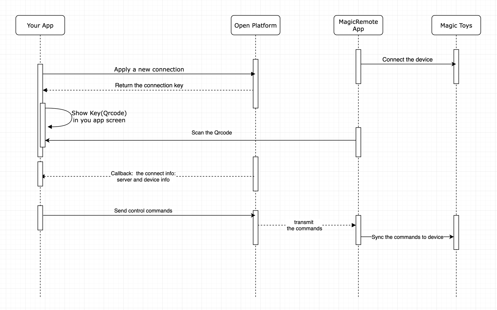

# Saxlet Open Platform Development Doc

## Introduction

*  Saxlet Open Platform (SaxletOP) is an open platform for sex toys industry. Developers can register and enpower their applications, websites, and platforms (Hereafter we will refer to it as SaxletOP App for short) the capability to remote control sex toys connected by Saxlet Connect with SaxletOP  APIs.

## Guideline

1. Registration
     * Go to [https://mg-dash.vtio.cn/](https://mg-dash.vtio.cn/) and register
     * You will received a verification email and click to register
2. Create an application, set a callback link and a secure domain name
    
     * Fill in your application name
     * Fill in the link that accepts the callback on your server. For the callback link description, please refer to `[Next Chapter]` `How to develop your application` `Step 3`
         * Every time the Saxlat Connect App is paired with your app (SaxletOP App), this link will accept a callback from the SaxletOP.
     * Fill in the address of the domain name where you store the funscript script which will push the script script later.  Please check whether the domain name conforms to the safe domain name rules, no http is needed here, only the bare domain name is required
3. Get AppID and AppSecret
     * After creating the app, you will get AppID and AppSecret on the page

## How to develop your application

* Flowchart

1. Apply for a new link
     * Link address `https://mg-api.vtio.cn/open/connect/apply` `POST`
     * The headers contain `{'token': [AppSecret of the application]}`
     * Return the key of the application link:
         * success: true/false
         * result:
             * {"key": [key]}

2. Convert the key into a QR code and display it on your app interface
     * Web page
         * Native JS [qrcode.js](http://davidshimjs.github.io/qrcodejs/)
         * NodeJs [node-qrcode](https://www.npmjs.com/package/qrcode)
         *Android
     * iOS
3. Use Saxlet Connect App to scan the QR code displayed on your SaxletOP App
4. The open platform will call the callback link you configured and send the link information
     * Please accept the form with `POST` on your server, the form key is `data`
     * data contains:
         * `key` the key of the link
         * `code` is the authentication code when pushing the command
         * `server` server configuration information, including access link address, etc...
         * Information about the device controlled by `device`
5. Send command
     * Send a `post` request to the url contained in the `server` information
     * Form content:
         * `key` the key of the link
         * `code` authentication code
         * `data` command content, dumped json string, see `push command`

6. Obtain device link information
     * Link address `https://mg-api.vtio.cn/open/device/status?key=[key]`
     * The headers contain `{'token': [AppSecret of the application]}`
     * It is pushed to query once in 3-5 seconds
     * Return device status and device information:
         * success: true/false
         * result:
             * device_status
                 * 1 online
                 * 2 offline
             * device
                 * json string of device information

## push command

### Common Controls

* vibration
     * cmd: s1
     * pos: vibration intensity 0-100

### Play funscript

* push script
     * cmd: script
     * link: download link

* play
     * cmd: play
     * ts: Timestamp on the playback sequence timeline
     * op_ts: Timestamp of the command operation

* pause
     * cmd: pause
     * op_ts: Timestamp of the command operation

* Addressing
     * cmd: seek
     * ts: Timestamp on the playback sequence timeline
     * op_ts: Timestamp of the command operation

* pair frame
     * cmd: frame
     * ts: Timestamp on the playback sequence timeline
     * op_ts: Timestamp of the command operation

## Demo

* [Demo](https://htmlpreview.github.io/?https://github.com/vtrump/magicremote-docs/blob/main/docs/demo.html)